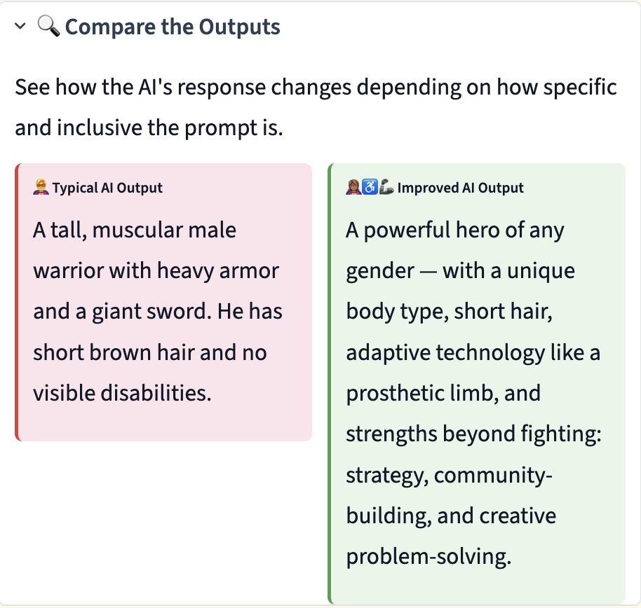
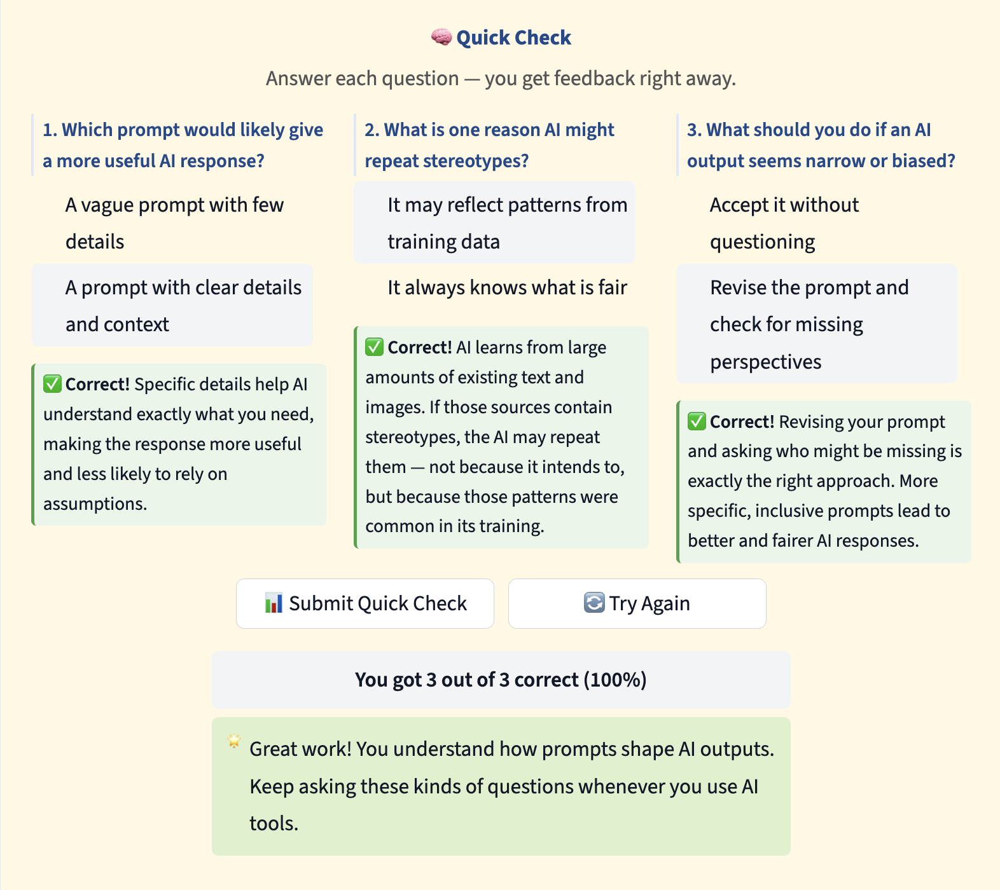
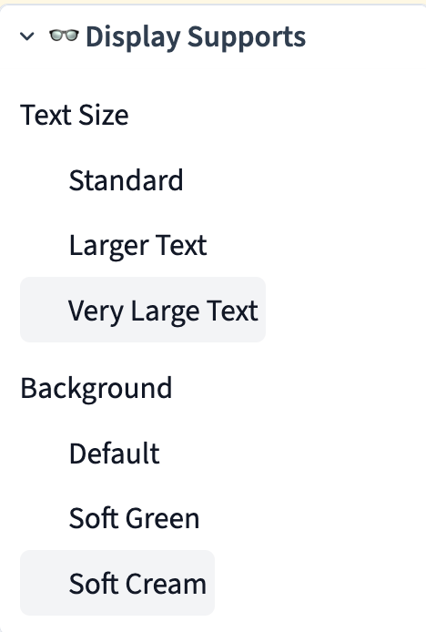

# 🤖 AI Literacy Prompt Explorer

🔗 **Live App:** https://ai-literacy-prompt-explorer-cdhba95yeweiq7mj8duryh.streamlit.app/

  

<em>How prompt design shapes AI outcomes - and why it matters.</em>

---

## 💡 Overview

The **AI Literacy Prompt Explorer** is an interactive learning tool that helps students and educators explore how AI responses are shaped by prompts - and how bias, assumptions, and missing perspectives can influence outputs.

This tool helps users:

* Understand how prompt quality impacts AI responses
* Identify bias and incomplete outputs
* Practice improving prompts for fairness, specificity, and inclusion
* Build critical thinking skills around AI-generated content

Designed for **classroom use, professional development, AI literacy workshops, and digital citizenship instruction**.

---

## 🧠 Key Features

### 🎯 Scenario-Based Learning

Users explore real-world contexts such as:

* Video game character design
* School policies
* Technology access
* AI recommendation systems

Each scenario highlights how bias can emerge in AI outputs.

---

### 🧪 Quick Check with Immediate Feedback

  

<em>Real-time formative feedback reinforces understanding of prompt quality and AI bias.</em>

Students receive instant feedback with explanations, supporting learning without requiring instructor intervention.

---

### 🔍 Compare AI Outputs

  

<em>Side-by-side comparison shows how inclusive, specific prompts produce more equitable AI outputs.</em>

Users can clearly see the difference between a vague, biased prompt and an improved, inclusive prompt.

---

### ♿ Accessibility & Display Supports

  

<em>Adjustable text size and background settings support accessibility and diverse learner needs.</em>

Features include:

* Multiple text size options
* Soft color backgrounds for readability
* Clean, distraction-free interface

---

### ✏️ Active Learning: “Your Turn”

Users practice applying what they learn by:

* Identifying types of bias, including race, gender, access, and accessibility
* Explaining their reasoning
* Rewriting prompts to improve AI fairness and clarity

---

## 🛠️ Built With

* **Python**
* **Streamlit**
* **Custom CSS** for accessibility and UI enhancements
* Instructional design principles grounded in inclusive learning

---

## 🎯 Why This Matters

AI tools are increasingly used in education, hiring, content creation, and decision-making systems.

Without strong prompt design and critical thinking, AI can:

* Reinforce stereotypes
* Exclude perspectives
* Produce incomplete or misleading outputs

This tool helps learners **interact with AI thoughtfully, not passively**.

---

## 👩‍💻 About the Developer

**Jennifer Nolan**
*Developed May 2026*

Experienced educator and instructional leader focused on:

* AI literacy
* Inclusive instruction
* Human-centered technology use
* Accessible learning design

---

## 📌 Use Cases

* K-12 classrooms
* Teacher professional development
* AI literacy workshops
* Digital citizenship lessons
* EdTech demonstrations
* Learning and development portfolios

---

## ⭐ What This Project Demonstrates

* Instructional design for complex concepts
* Human-centered AI education
* Accessibility-aware UI design
* Practical application of AI ethics concepts
* Real-world classroom usability
* Prompt engineering and AI literacy support
